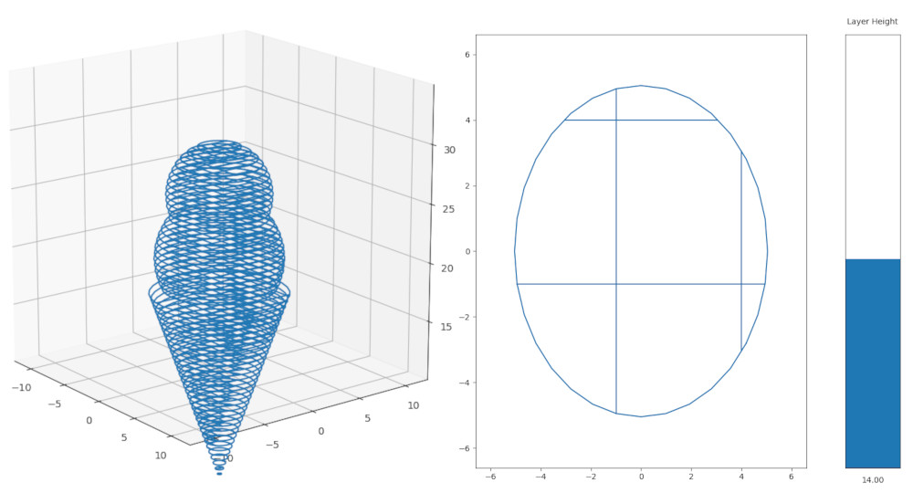

# sliceofpy: 3D Object Slicing

[](https://travis-ci.org/ttumiel/sliceofpy)

A command line 3D object slicer. Easily understandable, pretty configurable.

## Install

Install from GitHub:

```bash
pip install git+https://github.com/ttumiel/sliceofpy
```

## Quickstart

Slice a `.obj` file in the current directory. Output G-code file is called `out.gcode`.

```sh
sliceofpy design.obj
```

For more info on any of the commands, type `sliceofpy -h`.

## Limitations

- The slicer does not generate supports for unsupported areas.
- There are probably some unsupported edge cases I haven't thought of.

I will gladly accept any contributions.

## Benefits

- The slicer is fairly easy to understand (~800 LOC)
- The slicer is pretty configurable both from the command line and if you imported it as a function.
- You can plot the result of the slicing in 3D (with or without intermediate movements) or in 2D with a slider for the slices along the z-axis.

## How it was made

[Read about it here](https://ttumiel.github.io/blog/slicer/)
